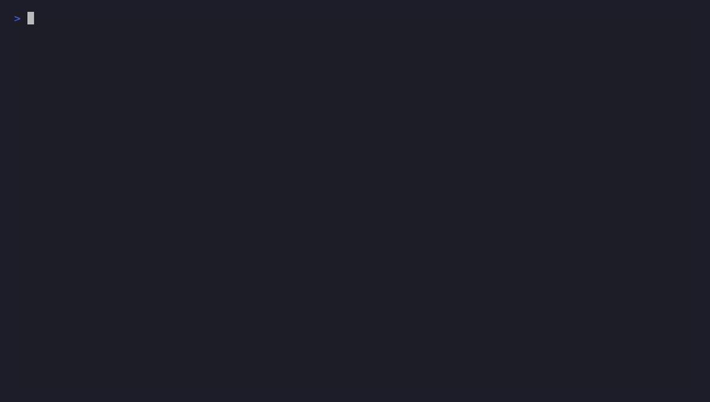

```
#####  ###  #  #   ####  ###   #### #####
  #   #   # # #   #     #   # #       #
  #   #   # ##    #     #   #  ###    #
  #   #   # # #   #     #   #     #   #
  #    ###  #  #   ####  ###  ####    #
```

**Exact BPE token counts and cost estimates for LLM text — files, pipes, or a
live command, from a single dependency-free Rust binary.**

[](https://github.com/abhiprd2000/tokcost/actions/workflows/ci.yml)
[](LICENSE)



## Why

Every other token counter I could find either shells out to Python, vendors
a `tiktoken` binding, or just guesses `chars / 4` and calls it a day. tokcost
is a ~2,000-line Rust binary (tests included) with **zero crate
dependencies** — no `regex`, no `serde`, no `clap`, nothing in
`[dependencies]` at all. The BPE encoder, the JSON output, the argument
parser, and the live ticker's ANSI are all hand-rolled. The two real
tiktoken vocabularies (`cl100k_base`, `o200k_base`, ~300k merge rules
combined) are embedded at build time from the canonical rank files and
checked against real `tiktoken` output in CI.

## Install

```sh
cargo install --locked --git https://github.com/abhiprd2000/tokcost
```

Prebuilt binaries for Linux, macOS (x86_64 + arm64), and Windows are
attached to each [release](https://github.com/abhiprd2000/tokcost/releases).

## Usage

```sh
# Count tokens in one or more files
tokcost src/main.rs

# Read from a pipe
cat prompt.txt | tokcost --model gpt-4o

# Machine-readable output
tokcost --json prompt.txt

# Live-wrap a streaming command and watch cost accrue as it runs
tokcost meter --model gpt-4o -- your-llm-cli chat

# Override pricing without waiting for a new release
TK_PRICES="gpt-4o=2.50:10.00" tokcost --model gpt-4o prompt.txt
```

Run `tokcost --help` for the full flag list.

## How it works

- **`src/bpe.rs`** — the BPE encoder, in two parts: a pretokenizer that
  produces the same final token IDs as tiktoken's
  `cl100k_base`/`o200k_base` split regexes using a plain left-to-right
  character scan (no `regex` crate — Unicode letter/digit/case
  classification comes from `char`'s own methods, which ship in libcore;
  see the disclosure below for exactly what "same token IDs" does and
  doesn't mean), and the reference merge loop tiktoken itself documents as
  its "educational" implementation (repeatedly merge the lowest-rank
  adjacent byte pair until none remain).
- **`build.rs`** — parses the canonical `.tiktoken` rank files committed in
  `assets/` (hand-rolled base64 decoder, since even that's a crate
  elsewhere), verifies every rank is sequential from 0 as a build-time
  integrity check, and emits compact binary blobs `include_bytes!`'d into
  the binary. `src/vocab.rs` reconstructs the rank tables from those blobs
  lazily, once, via `std::sync::OnceLock`.
- **`src/pricing.rs`** — a static USD-per-million-token table with an
  as-of date, overridable per-model via `TK_PRICES` without a rebuild.
- **`src/render.rs`** — a small write-only JSON value type (this tool only
  ever emits JSON, never parses it) plus raw ANSI escape helpers.
- **`src/meter.rs`** — tees a wrapped command's stdout through unchanged
  while streaming a running token/cost ticker to stderr.
- **`tests/golden.rs`** — checks the hand-rolled encoder against fixtures
  generated from *real* `tiktoken` output (`scripts/gen_golden_fixtures.py`,
  a dev-only script — `tiktoken` is never a tokcost dependency).

## Honest disclosures

This tool would rather show you `n/a` than a confident-looking wrong number.

- **Claude token counts are an estimate, not a count.** Anthropic doesn't
  publish Claude's tokenizer, so there's no way to count Claude tokens
  exactly outside their API. tokcost falls back to a calibrated heuristic
  (~3.5 characters per token, per Anthropic's own public guidance) and
  labels it `~tokens` everywhere in the output — CLI text, JSON's `"exact"`
  field, and the live ticker — plus an explicit warning on stderr. If you
  need an exact Claude count, use Anthropic's API directly.
- **Pricing is a dated snapshot, not a live source.** tokcost makes zero
  network calls, ever, so `src/pricing.rs`'s table is only as current as
  its `PRICING_AS_OF` date. Use `TK_PRICES` to correct it, or a model
  tokcost doesn't recognize will honestly report `n/a` instead of a made-up
  cost.
- **The pretokenizer is deliberately coarser than tiktoken's regexes —
  equal token IDs, not equal split boundaries.** Real `o200k_base` cuts a
  word at every lowercase→uppercase transition (`myVariable` → `my` |
  `Variable`); tokcost keeps the whole run as one piece. That coalescing is
  provably harmless *by construction*: BPE vocabularies are learned from
  text that was pretokenized by this same regex first, so no merge rule in
  the shipped rank tables can span a boundary the real splitter always
  draws — the merge loop finds nothing to merge across it, and the final
  token IDs come out identical. (The reverse — splitting *finer* than the
  real regex — is not safe, and tokcost never does it.) The golden tests
  verify the resulting IDs against real `tiktoken` output, including
  camelCase and mixed-case-contraction cases. tokcost does not claim
  boundary-for-boundary regex fidelity, only ID-for-ID output equality.
- **`o200k_base`'s Unicode mark detection is best-effort** — and unlike the
  coarsening above, this one is a genuine approximation. The split pattern
  treats combining marks (`\p{M}`) as word characters. Rust's `char` gives
  exact, free letter/digit/case classification, but has no combining-mark
  accessor, so tokcost's detector only covers the common Latin-adjacent
  combining-diacritic Unicode blocks. Text in scripts whose marks fall
  outside those blocks may genuinely tokenize differently than real
  `o200k_base`. Pinned down by the golden tests; not yet exhaustive.
- **The live ticker can't redraw in place.** Stdout is tee'd byte-for-byte
  so piping the wrapped command elsewhere still works, which means it can
  end mid-line at any point. A single overwriting ticker line sharing that
  terminal would eventually land on a partial line and corrupt it, so the
  ticker instead prints one newline-terminated frame per update — a
  scrolling log rather than an animated line.
- **The wrapped command's stdout is a pipe, not a terminal.** Some programs
  fully buffer their output instead of line-buffering it once they detect a
  non-TTY stdout, so `tokcost meter`'s ticker can update in bursts for such
  programs. Fixing this properly means a pseudo-TTY (`openpty` on Unix,
  `ConPTY` on Windows) — unrelated, unsafe, platform-specific APIs that
  don't fit a zero-dependency, cross-platform tool.

## Development

```sh
cargo test                          # unit + golden tests
cargo fmt --check && cargo clippy --all-targets -- -D warnings

# Regenerate golden fixtures from real tiktoken (dev-only, not shipped)
pip install tiktoken
python3 scripts/gen_golden_fixtures.py

# Regenerate the README demo GIF (needs https://github.com/charmbracelet/vhs)
cargo build --release
vhs demo/demo.tape
```

## License

MIT
